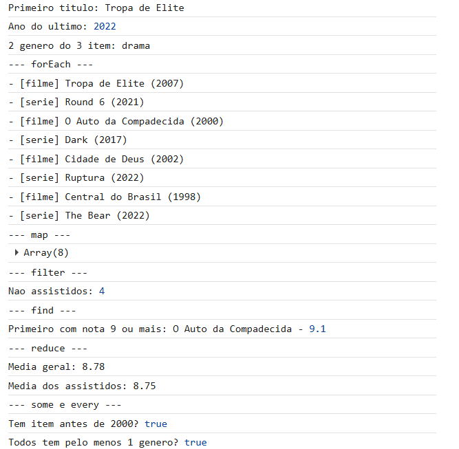
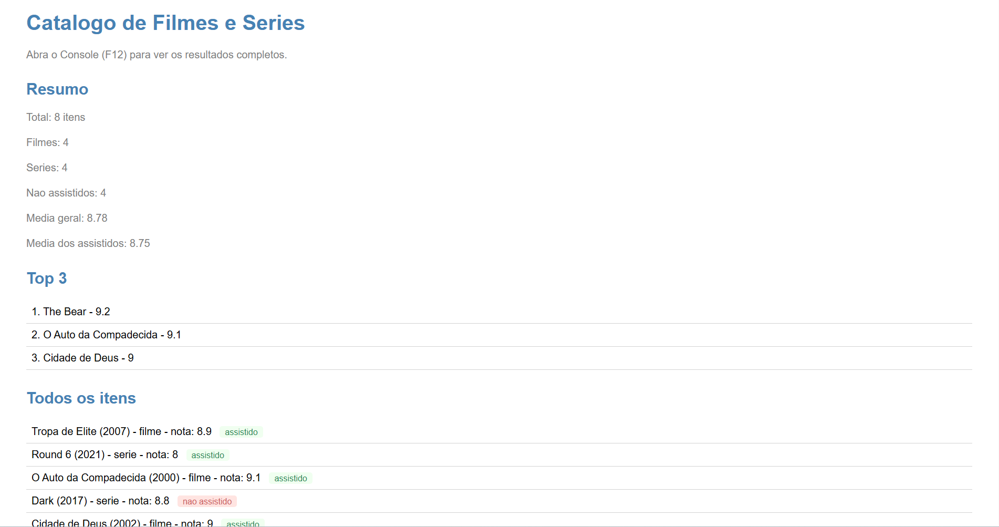

# Trabalho Prático - Semana 6

Nessa atividade, como sempre, vamos evoluir o que foi feito na semana anterior. Fique atento para fazer o projeto da semana anterior e dar sequência nessa jornada.

No trabalho dessa semana vamos alterar o projeto para que a responsividade da home-page seja feita, agora, com o framework Bootstrap.

**IMPORTANTE 1:** Você deve alterar apenas os arquivos **`README.md`**, **`index.html`** e **`styles.css`**, podendo incluir outros arquivos como imagens na pasta **`images`**, caso necessário. Deixe todos os demais arquivos e pastas desse repositório inalterados. **PRESTE MUITA ATENÇÃO NISSO.**

## Informações Gerais

- Nome: Pedro Henrique Da Silva Fonseca
- Matricula: 909109
- Proposta de projeto escolhida: Catalogo de filmes e séries
- Breve descrição sobre seu projeto: Catalogo de filmes e séries

Um print do Console do navegador mostrando a saída dos seguintes processos:
A listagem de títulos
O cálculo das médias
O resumo das checagens (some e every)

Um print da página mostrando o resumo dentro da div#output.

